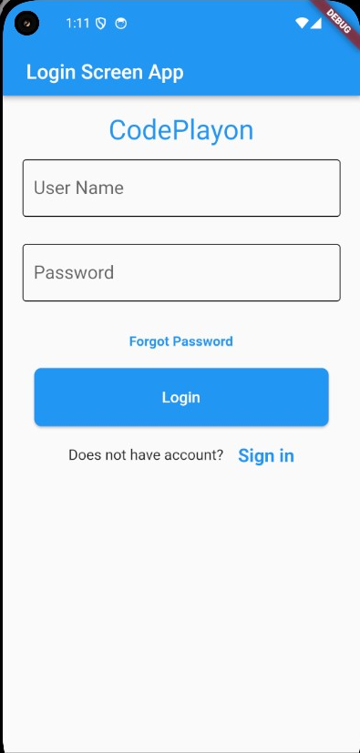

# Codeplayon Login Screen App

## Overview

The Codeplayon Login Screen App is designed to provide a seamless and secure user authentication experience. With its intuitive interface, users can easily log in to access the application.

## Features

- User-friendly interface
- 'Forgot Password' option for password recovery
- Quick sign-in option for new users

## Installation & Usage

Follow these steps to integrate the login screen into your application:

1. Clone this repository.
2. Navigate to the project folder and install dependencies (if any).
3. Import the login screen component into your application.
4. Customize styles and themes as needed.

## Support & Contribution

Feel free to contribute, raise issues, or suggest enhancements to improve the login screen app.

We are dedicated to providing a bug-free and user-friendly experience. For support or inquiries, reach out to us at support@codeplayon.com.
